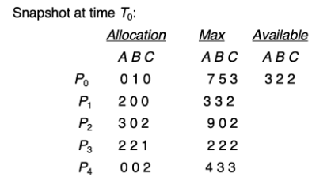

## Banker's Algorithm for Deadlock Avoidance

Banker's Algorithm is a resource allocation and deadlock-avoidance algorithm used in operating systems. It decides whether granting a resource request keeps the system in a safe state. A safe state means there exists some ordering of processes (a safe sequence) where each process can obtain the resources it needs, finish, and release resources so all processes can complete without deadlock.

## Problem:

Considering a system with five processes P0 through P4 and three resources of type A, B, C.
Resource type A has 10 instances, B has 5 instances and type C has 7 instances. Suppose at
time t0 following snapshot of the system has been taken:



### Question
Implement the Banker's algorithm to answer the following question: Is the system in a safe-state? If Yes, then what is the safe sequence?

### Answer
The Environment of the system is we have 5 processes and 3 resource types.<br>
After running Bankers Algorithm:

```bash
./bankers system.txt
```

Is the system in a safe-state? `YES`.<br>
If *yes*, then what is the safe sequence? `P3 -> P4 -> P1 -> P2 -> P0`.

## Build
### Dependencies:
Install the following dependencies before attempting to build:
```bash
sudo apt update && sudo apt install g++
```

### Build instructions
```bash
git clone https://github.com/vortexxxxxxxxxxxx/Misc-School-Work/tree/main/Operating%20Systems%20Fall%202025/OS_Bankers_Algorithm
cd OS_Bankers_Algorithm
chmod +x run.sh
./run.sh
```

*More about run.sh*:<br>
`./run.sh` is a bash-script used to automate program compiling and execution of the binary `bankers`.
```
Usage: $0 [compile|run_all|help]

Commands:
  help          Display this help text
  compile       Build the Bankers binary
  run_all       Build and run Bankers with data1-3.txt

 Example:
   ./bankers data1.txt
```

### Input Files
Contents from [data3.txt](data3.txt)
```text
0 1 2
2 0 1
1 2 1
3 0 0
1 1 1
7 5 3
6 4 2
5 3 3
4 3 3
4 2 2
3 3 2
```

- The first 5 rows represent the Allocation Matrix.
- The next 5 rows represent the Maximum Demand Matrix.
- The last row represents the Available Resources.

## Expected Outputs
#### Output During Safe State
```
./bankers data1.txt
-Reading ./data1.txt
-Finished reading ./data1.txt
-Running Environment
      Max Processes -> 5
      Max Resources -> 3
-System is in a Safe state.
      safe-sequence: P1 -> P3 -> P4 -> P0 -> P2
```

#### Output During Unsafe State
```
./bankers data2.txt
-Reading data2.txt
-Finished reading data2.txt
-Running Environment
      Max Processes -> 5
      Max Resources -> 3
-System is in an Unsafe state.
```

## Output of Running Program

```
mkeffer4@gamer:~/OS2025/OS_Bankers_Algorithm$ ./run.sh
Usage: $0 [compile|run_all|help]

Commands:
  help          Display this help text
  compile       Build the Bankers binary
  run_all       Build and run Bankers with data1-3.txt

 Example:
   ./bankers data1.txt
mkeffer4@gamer:~/OS2025/OS_Bankers_Algorithm$ ./run.sh run_all
-Compiling Bankers program...
-Running Bankers with data1-3.txt files...
============================================
-Reading ./data1.txt
-Finished reading ./data1.txt
-Running Environment
      Max Processes -> 5
      Max Resources -> 3
-System is in a Safe state.
      safe-sequence: P1 -> P3 -> P4 -> P0 -> P2

-Reading ./data2.txt
-Finished reading ./data2.txt
-Running Environment
      Max Processes -> 5
      Max Resources -> 3
-System is in an Unsafe state!

-Reading ./data3.txt
-Finished reading ./data3.txt
-Running Environment
      Max Processes -> 5
      Max Resources -> 3
-System is in a Safe state.
      safe-sequence: P4 -> P1 -> P2 -> P3 -> P0

mkeffer4@gamer:~/OS2025/OS_Bankers_Algorithm$
```


## Deep Dive into Banker's Algorithm

The Banker’s Algorithm is a deadlock avoidance algorithm that ensures a system never enters a deadlock state. It simulates resource allocation requests and determines whether granting the request would leave the system in a safe state (i.e., a state where all processes can complete execution).

The algorithm works based on three matrices:
-Maximum: The maximum number of resources each process might need.
-Allocated: The number of resources currently allocated to each process.
-Available: The number of free resources currently available.

The algorithm then checks whether granting a resource request would result in a system state where all processes can eventually finish without deadlocks.

Steps of the Banker’s Algorithm
Check if the Request is Within the Maximum Need:<br>
-The requested resources must not exceed the maximum declared by the process.
Check if Resources are Available:<br>
-If the requested resources exceed the number of currently available resources, the process must wait.
Pretend to Allocate Resources Temporarily:<br>
-Simulate granting the request and update the Available, Allocated, and Need matrices.
Check for Safe State:<br>
-Determine if the new resource allocation leads to a safe state where all processes can finish execution. If not, roll back the temporary allocation.

If the system remains in a safe state after granting the request, the resources are allocated; otherwise, the request is denied.

Some Key concepts include the "Safe" state and "Unsafe" state.
Safe State: There exists at least one sequence of processes such that each process can obtain the needed resources, complete its execution, release its resources, and thus allow other processes to eventually complete without entering a deadlock.

Unsafe State: Even though the system can still allocate resources to some processes, there is no guarantee that all processes can finish without potentially causing a deadlock.


Bankers Algorithm has both pros and cons.
Pros:
-Prevents deadlocks by simulating and checking safe states before granting requests.
-Efficient for small to medium-scale systems with predictable resource requirements.
-Simple to implement in systems where the maximum resource needs are known in advance.
Cons:
-The algorithm requires processes to declare their maximum resource needs in advance, which may not be possible in all applications.
-It may lead to unnecessary denial of requests in systems with fluctuating resource demands.
-The algorithm can become inefficient for large systems with many concurrent processes and resource types.
-It assumes that the number of available resources remains static, which may not reflect real-world conditions.

